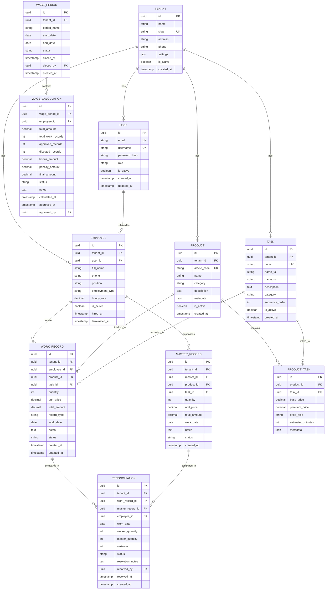
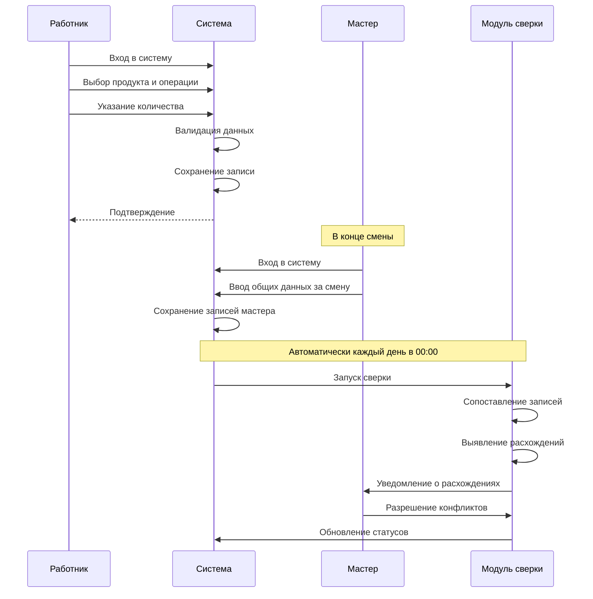
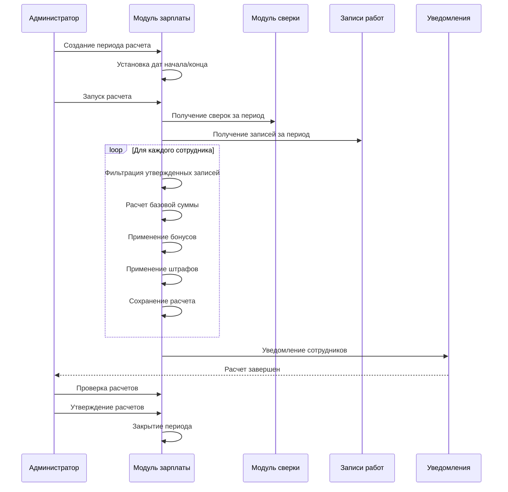

# SEW-TRACK: Платформа управления швейным производством

## 📋 Обзор проекта

**SEW-TRACK** - это система управления производством для швейных цехов, работающих по конвейерному принципу. Система автоматизирует учет выполненных работ, расчет заработной платы и контроль качества производства.

### Основные возможности
- ✅ Учет выполненных операций каждым сотрудником
- ✅ Регистрация работ мастером (контроллер качества)
- ✅ Автоматический расчет заработной платы по сдельной системе
- ✅ Сверка данных работника и мастера
- ✅ Детальная отчетность (дневная, месячная, периодическая)
- ✅ Управление продуктами и операциями
- ✅ Аналитика производительности

---

## 🏗️ Архитектура системы

### Django Best Practices Architecture

Система построена на основе **Django Best Practices** с модульной структурой приложений:

```
sew-track/
│
├── apps/                        # Django приложения
│   ├── accounts/                # 👤 Пользователи и аутентификация
│   │   ├── migrations/
│   │   ├── management/
│   │   │   └── commands/
│   │   ├── models.py
│   │   ├── admin.py
│   │   ├── serializers.py
│   │   ├── views.py
│   │   ├── urls.py
│   │   ├── permissions.py
│   │   ├── services.py         # Бизнес-логика
│   │   └── tests.py
│   │
│   ├── employees/               # 👷 Управление сотрудниками
│   │   ├── migrations/
│   │   ├── models.py
│   │   ├── admin.py
│   │   ├── serializers.py
│   │   ├── views.py
│   │   ├── urls.py
│   │   ├── services.py
│   │   └── tests.py
│   │
│   ├── products/                # 👗 Продукты и артикулы
│   │   ├── migrations/
│   │   ├── models.py            # Product, ProductTask
│   │   ├── admin.py
│   │   ├── serializers.py
│   │   ├── views.py
│   │   ├── urls.py
│   │   ├── services.py
│   │   └── tests.py
│   │
│   ├── tasks/                   # 📋 Операции (задачи)
│   │   ├── migrations/
│   │   ├── models.py            # Task
│   │   ├── admin.py
│   │   ├── serializers.py
│   │   ├── views.py
│   │   ├── urls.py
│   │   └── tests.py
│   │
│   ├── work_records/            # 📝 Учет работ
│   │   ├── migrations/
│   │   ├── models.py            # WorkRecord, MasterRecord
│   │   ├── admin.py
│   │   ├── serializers.py
│   │   ├── views.py
│   │   ├── urls.py
│   │   ├── services.py          # Логика создания и валидации
│   │   ├── filters.py
│   │   └── tests.py
│   │
│   ├── reconciliation/          # 🔄 Сверка данных
│   │   ├── migrations/
│   │   ├── models.py            # Reconciliation
│   │   ├── admin.py
│   │   ├── serializers.py
│   │   ├── views.py
│   │   ├── urls.py
│   │   ├── services.py          # Логика сверки
│   │   └── tests.py
│   │
│   └── wages/                   # 💰 Расчет зарплаты
│       ├── migrations/
│       ├── models.py            # WagePeriod, WageCalculation
│       ├── admin.py
│       ├── serializers.py
│       ├── views.py
│       ├── urls.py
│       ├── services.py          # Калькуляторы зарплаты
│       ├── calculators.py       # Бизнес-логика расчетов
│       └── tests.py
│
├── core/                        # 🔷 Общие утилиты
│   ├── models.py                # Базовые модели (TimeStampedModel)
│   ├── mixins.py                # Mixins для views
│   ├── exceptions.py            # Кастомные исключения
│   ├── utils.py                 # Вспомогательные функции
│   ├── validators.py            # Общие валидаторы
│   └── permissions.py           # Базовые permissions
│
├── config/                      # ⚙️ Настройки Django
│   ├── settings/
│   │   ├── __init__.py
│   │   ├── base.py
│   │   ├── development.py
│   │   ├── production.py
│   │   └── test.py
│   ├── urls.py
│   ├── wsgi.py
│   └── asgi.py
│
├── static/                      # 🎨 Статические файлы
├── media/                       # 📁 Загруженные файлы
├── templates/                   # 📄 Django шаблоны
│   ├── admin/
│   └── emails/
│
├── locale/                      # 🌍 Переводы (uz, ru)
│   ├── uz/
│   └── ru/
│
├── celery_app/                  # 📬 Celery конфигурация
│   ├── __init__.py
│   ├── celery.py
│   └── tasks.py                 # Общие задачи
│
├── docs/                        # 📚 Документация
│   ├── PROJECT_CONCEPT.md
│   ├── API.md
│   └── DEPLOYMENT.md
│
├── requirements/                # 📦 Зависимости
│   ├── base.txt
│   ├── development.txt
│   ├── production.txt
│   └── test.txt
│
├── scripts/                     # 🔧 Скрипты
│   ├── init_db.py
│   └── load_tasks.py
│
├── tests/                       # 🧪 Интеграционные тесты
│   ├── integration/
│   └── factories.py
│
├── .env.example
├── .gitignore
├── docker-compose.yml
├── Dockerfile
├── manage.py
├── pytest.ini
├── ruff.toml
└── README.md
```

---

## 🗄️ Модель данных

### ERD (Entity Relationship Diagram)



---

## 🔧 Технологический стек

### Backend
- **Framework**: Django 5.2+
- **API**: Django REST Framework 3.15+
- **Database**: PostgreSQL 16+
- **Cache**: Redis 7+
- **Task Queue**: Celery 5+ (для автоматической сверки)
- **Authentication**: djangorestframework-simplejwt (JWT tokens)
- **Permissions**: DRF built-in permissions
- **Documentation**: drf-spectacular (OpenAPI 3.0)

### Infrastructure
- **Containerization**: Docker + Docker Compose
- **Web Server**: Nginx
- **WSGI Server**: Gunicorn

### Development Tools
- **Linting**: Ruff
- **Testing**: pytest + pytest-django + factory-boy
- **Fixtures**: django-fixtures (для начальных данных)

### Monitoring & Logging
- **Logging**: Python logging + structlog
- **Monitoring**: Django Debug Toolbar (dev)

---

## 📱 API Дизайн

### Базовая структура API

```
/api/v1/
├── auth/
│   ├── login/                    POST   # Вход в систему
│   ├── logout/                   POST   # Выход
│   ├── refresh/                  POST   # Обновление токена
│   └── me/                       GET    # Текущий пользователь
│
├── tenants/
│   ├── /                         GET, POST
│   ├── /{id}/                    GET, PUT, PATCH, DELETE
│   └── /{id}/settings/           GET, PATCH
│
├── users/
│   ├── /                         GET, POST
│   ├── /{id}/                    GET, PUT, PATCH, DELETE
│   └── /{id}/change-password/    POST
│
├── employees/
│   ├── /                         GET, POST
│   ├── /{id}/                    GET, PUT, PATCH, DELETE
│   ├── /{id}/activate/           POST
│   ├── /{id}/deactivate/         POST
│   └── /{id}/statistics/         GET
│
├── products/
│   ├── /                         GET, POST
│   ├── /{id}/                    GET, PUT, PATCH, DELETE
│   ├── /{id}/tasks/              GET, POST
│   └── /{id}/tasks/{task_id}/    GET, PUT, PATCH, DELETE
│
├── tasks/
│   ├── /                         GET, POST
│   ├── /{id}/                    GET, PUT, PATCH, DELETE
│   └── /categories/              GET
│
├── work-records/
│   ├── /                         GET, POST
│   ├── /{id}/                    GET, PUT, PATCH, DELETE
│   ├── /bulk-create/             POST
│   ├── /my-records/              GET
│   ├── /daily-summary/           GET
│   ├── /monthly-summary/         GET
│   └── /statistics/              GET
│
├── master-records/
│   ├── /                         GET, POST
│   ├── /{id}/                    GET, PUT, PATCH, DELETE
│   ├── /bulk-create/             POST
│   ├── /daily-summary/           GET
│   └── /statistics/              GET
│
├── reconciliation/
│   ├── /                         GET
│   ├── /{id}/                    GET
│   ├── /pending/                 GET
│   ├── /resolve/{id}/            POST
│   ├── /daily-report/            GET
│   └── /export/                  GET
│
└── wages/
    ├── periods/
    │   ├── /                     GET, POST
    │   ├── /{id}/                GET, PUT, PATCH
    │   ├── /{id}/close/          POST
    │   └── /{id}/reopen/         POST
    │
    ├── calculations/
    │   ├── /                     GET
    │   ├── /{id}/                GET
    │   ├── /calculate/           POST
    │   ├── /approve/{id}/        POST
    │   └── /export/              GET
    │
    └── reports/
        ├── /employee/{id}/       GET
        ├── /period/{id}/         GET
        └── /summary/             GET
```

---

## 🎯 Примеры реализации ключевых модулей

### 1. **Core Models** (Базовые модели)

```python
# core/models.py
import uuid
from django.db import models

class TimeStampedModel(models.Model):
    """Абстрактная модель с временными метками"""
    id = models.UUIDField(primary_key=True, default=uuid.uuid4, editable=False)
    created_at = models.DateTimeField(auto_now_add=True)
    updated_at = models.DateTimeField(auto_now=True)
    
    class Meta:
        abstract = True
```

### 2. **Work Records App** (Ключевой модуль)

```python
# apps/work_records/models.py
from django.db import models
from django.core.validators import MinValueValidator, MaxValueValidator
from core.models import TimeStampedModel

class RecordStatus(models.TextChoices):
    PENDING = 'pending', 'В ожидании'
    APPROVED = 'approved', 'Утверждено'
    DISPUTED = 'disputed', 'Спорная'
    REJECTED = 'rejected', 'Отклонено'

class RecordType(models.TextChoices):
    WORKER = 'worker', 'Работник'
    MASTER = 'master', 'Мастер'

class WorkRecord(TimeStampedModel):
    """Запись о выполненной работе"""
    employee = models.ForeignKey(
        'employees.Employee',
        on_delete=models.PROTECT,
        related_name='work_records',
        verbose_name='Сотрудник'
    )
    product = models.ForeignKey(
        'products.Product',
        on_delete=models.PROTECT,
        related_name='work_records',
        verbose_name='Продукт'
    )
    task = models.ForeignKey(
        'tasks.Task',
        on_delete=models.PROTECT,
        related_name='work_records',
        verbose_name='Операция'
    )
    quantity = models.PositiveIntegerField(
        verbose_name='Количество',
        validators=[MinValueValidator(1), MaxValueValidator(1000)]
    )
    unit_price = models.DecimalField(
        max_digits=10,
        decimal_places=2,
        verbose_name='Цена за единицу'
    )
    total_amount = models.DecimalField(
        max_digits=12,
        decimal_places=2,
        verbose_name='Общая сумма',
        editable=False
    )
    record_type = models.CharField(
        max_length=10,
        choices=RecordType.choices,
        default=RecordType.WORKER,
        verbose_name='Тип записи'
    )
    work_date = models.DateField(verbose_name='Дата работы')
    status = models.CharField(
        max_length=10,
        choices=RecordStatus.choices,
        default=RecordStatus.PENDING,
        verbose_name='Статус'
    )
    notes = models.TextField(blank=True, verbose_name='Примечания')
    
    class Meta:
        db_table = 'work_records'
        verbose_name = 'Запись о работе'
        verbose_name_plural = 'Записи о работе'
        ordering = ['-work_date', '-created_at']
        indexes = [
            models.Index(fields=['employee', 'work_date']),
            models.Index(fields=['product', 'task']),
            models.Index(fields=['status']),
        ]
        constraints = [
            models.UniqueConstraint(
                fields=['employee', 'product', 'task', 'work_date', 'record_type'],
                name='unique_work_record_per_day'
            )
        ]
    
    def save(self, *args, **kwargs):
        """Автоматический расчет total_amount при сохранении"""
        self.total_amount = self.unit_price * self.quantity
        super().save(*args, **kwargs)
    
    def approve(self):
        """Утверждение записи"""
        if self.status == RecordStatus.PENDING:
            self.status = RecordStatus.APPROVED
            self.save(update_fields=['status', 'updated_at'])
    
    def dispute(self, reason: str):
        """Оспаривание записи"""
        self.status = RecordStatus.DISPUTED
        self.notes = f"{self.notes}\nСпорная запись: {reason}"
        self.save(update_fields=['status', 'notes', 'updated_at'])
    
    def __str__(self):
        return f"{self.employee} - {self.task} ({self.work_date})"


# apps/work_records/services.py
from datetime import date
from decimal import Decimal
from django.db import transaction
from django.utils import timezone
from rest_framework.exceptions import ValidationError

class WorkRecordService:
    """Сервис для бизнес-логики записей"""
    
    @transaction.atomic
    def create_work_record(self, employee, product, task, quantity, work_date, notes=''):
        """Создание записи о работе с валидацией"""
        
        # 1. Проверка даты
        if work_date > date.today():
            raise ValidationError("Дата работы не может быть в будущем")
        
        # 2. Проверка активности сотрудника
        if not employee.is_active:
            raise ValidationError("Сотрудник неактивен")
        
        # 3. Получение цены операции
        try:
            product_task = product.product_tasks.get(task=task)
            unit_price = product_task.base_price
        except Exception:
            raise ValidationError("Операция не настроена для данного продукта")
        
        # 4. Проверка дубликатов
        if WorkRecord.objects.filter(
            employee=employee,
            product=product,
            task=task,
            work_date=work_date,
            record_type=RecordType.WORKER
        ).exists():
            raise ValidationError("Запись за этот день уже существует")
        
        # 5. Создание записи
        work_record = WorkRecord.objects.create(
            employee=employee,
            product=product,
            task=task,
            quantity=quantity,
            unit_price=unit_price,
            record_type=RecordType.WORKER,
            work_date=work_date,
            notes=notes
        )
        
        return work_record
    
    def get_daily_summary(self, employee, work_date):
        """Получение дневного отчета"""
        records = WorkRecord.objects.filter(
            employee=employee,
            work_date=work_date,
            record_type=RecordType.WORKER
        ).select_related('product', 'task')
        
        total_amount = sum(r.total_amount for r in records)
        
        return {
            'date': work_date,
            'records': records,
            'total_records': records.count(),
            'total_quantity': sum(r.quantity for r in records),
            'total_amount': total_amount
        }


# apps/work_records/serializers.py
from rest_framework import serializers
from .models import WorkRecord
from .services import WorkRecordService

class WorkRecordSerializer(serializers.ModelSerializer):
    employee_name = serializers.CharField(source='employee.full_name', read_only=True)
    product_name = serializers.CharField(source='product.name', read_only=True)
    task_name = serializers.CharField(source='task.name_uz', read_only=True)
    
    class Meta:
        model = WorkRecord
        fields = [
            'id', 'employee', 'employee_name', 'product', 'product_name',
            'task', 'task_name', 'quantity', 'unit_price', 'total_amount',
            'work_date', 'status', 'notes', 'created_at'
        ]
        read_only_fields = ['unit_price', 'total_amount', 'status']
    
    def create(self, validated_data):
        service = WorkRecordService()
        return service.create_work_record(
            employee=validated_data['employee'],
            product=validated_data['product'],
            task=validated_data['task'],
            quantity=validated_data['quantity'],
            work_date=validated_data['work_date'],
            notes=validated_data.get('notes', '')
        )


# apps/work_records/views.py
from rest_framework import viewsets, status
from rest_framework.decorators import action
from rest_framework.response import Response
from rest_framework.permissions import IsAuthenticated
from .models import WorkRecord
from .serializers import WorkRecordSerializer
from .services import WorkRecordService

class WorkRecordViewSet(viewsets.ModelViewSet):
    """ViewSet для управления записями о работе"""
    queryset = WorkRecord.objects.all()
    serializer_class = WorkRecordSerializer
    permission_classes = [IsAuthenticated]
    
    def get_queryset(self):
        """Фильтрация по текущему пользователю"""
        user = self.request.user
        if user.is_staff:
            return WorkRecord.objects.all()
        return WorkRecord.objects.filter(employee__user=user)
    
    @action(detail=False, methods=['get'])
    def my_records(self, request):
        """Получение записей текущего пользователя"""
        employee = request.user.employee
        records = WorkRecord.objects.filter(employee=employee)
        serializer = self.get_serializer(records, many=True)
        return Response(serializer.data)
    
    @action(detail=False, methods=['get'])
    def daily_summary(self, request):
        """Дневной отчет"""
        work_date = request.query_params.get('date')
        employee = request.user.employee
        
        service = WorkRecordService()
        summary = service.get_daily_summary(employee, work_date)
        
        return Response(summary)
```

### 3. **Reconciliation Service** (Сверка данных)

```python
# apps/reconciliation/services.py
from decimal import Decimal
from django.db import transaction
from apps.work_records.models import WorkRecord, RecordType
from .models import Reconciliation, ReconciliationStatus

class ReconciliationService:
    """Сервис сверки данных работников и мастера"""
    
    ACCEPTABLE_VARIANCE_PERCENT = Decimal('5.0')
    
    @transaction.atomic
    def run_daily_reconciliation(self, target_date):
        """Выполнение ежедневной сверки"""
        
        # 1. Получаем записи работников
        worker_records = WorkRecord.objects.filter(
            work_date=target_date,
            record_type=RecordType.WORKER
        ).select_related('employee', 'product', 'task')
        
        # 2. Получаем записи мастера
        master_records = WorkRecord.objects.filter(
            work_date=target_date,
            record_type=RecordType.MASTER
        ).select_related('employee', 'product', 'task')
        
        # 3. Группируем для сопоставления
        worker_map = self._group_records(worker_records)
        master_map = self._group_records(master_records)
        
        reconciliations = []
        variances = []
        
        # 4. Создаем записи сверки
        for key, worker_record in worker_map.items():
            if key in master_map:
                master_record = master_map[key]
                
                reconciliation = self._create_reconciliation(
                    worker_record, 
                    master_record
                )
                reconciliations.append(reconciliation)
                
                if reconciliation.status == ReconciliationStatus.VARIANCE:
                    variances.append(reconciliation)
        
        return {
            'date': target_date,
            'total': len(reconciliations),
            'matched': len([r for r in reconciliations if r.status == ReconciliationStatus.MATCHED]),
            'variances': len(variances)
        }
    
    def _group_records(self, records):
        """Группировка по ключу (сотрудник, продукт, задача)"""
        grouped = {}
        for record in records:
            key = (record.employee_id, record.product_id, record.task_id)
            grouped[key] = record
        return grouped
    
    def _create_reconciliation(self, worker_record, master_record):
        """Создание записи сверки"""
        variance = worker_record.quantity - master_record.quantity
        
        # Определяем статус
        if variance == 0:
            status = ReconciliationStatus.MATCHED
        else:
            variance_pct = abs(Decimal(variance)) / Decimal(master_record.quantity) * 100
            if variance_pct <= self.ACCEPTABLE_VARIANCE_PERCENT:
                status = ReconciliationStatus.MATCHED
            else:
                status = ReconciliationStatus.VARIANCE
        
        return Reconciliation.objects.create(
            work_record=worker_record,
            master_record=master_record,
            employee=worker_record.employee,
            work_date=worker_record.work_date,
            worker_quantity=worker_record.quantity,
            master_quantity=master_record.quantity,
            status=status
        )
```

### 4. **Wages Calculator** (Расчет зарплаты)

```python
# apps/wages/calculators.py
from decimal import Decimal
from django.db.models import Sum, Count, Q
from apps.work_records.models import WorkRecord, RecordStatus
from apps.reconciliation.models import Reconciliation, ReconciliationStatus
from .models import WageCalculation

class WageCalculator:
    """Калькулятор заработной платы"""
    
    QUALITY_BONUS_RATE = Decimal('0.10')  # 10% бонус
    QUALITY_THRESHOLD = Decimal('0.95')   # 95% точности
    PENALTY_PER_DISPUTE = Decimal('5000.00')
    
    def calculate_for_employee(self, employee, period):
        """Расчет зарплаты для сотрудника за период"""
        
        # 1. Получаем записи за период
        records = WorkRecord.objects.filter(
            employee=employee,
            work_date__range=[period.start_date, period.end_date],
            record_type='worker'
        )
        
        # 2. Фильтруем утвержденные
        approved = records.filter(status=RecordStatus.APPROVED)
        disputed = records.filter(status=RecordStatus.DISPUTED)
        
        # 3. Считаем базовую сумму
        total_amount = approved.aggregate(
            total=Sum('total_amount')
        )['total'] or Decimal('0.00')
        
        # 4. Считаем бонусы
        bonus = self._calculate_quality_bonus(employee, period, approved)
        
        # 5. Считаем штрафы
        penalty = self._calculate_penalties(disputed)
        
        # 6. Финальная сумма
        final_amount = total_amount + bonus - penalty
        
        # 7. Создаем расчет
        calculation = WageCalculation.objects.create(
            wage_period=period,
            employee=employee,
            total_amount=total_amount,
            total_work_records=records.count(),
            approved_records=approved.count(),
            disputed_records=disputed.count(),
            bonus_amount=bonus,
            penalty_amount=penalty,
            final_amount=final_amount
        )
        
        return calculation
    
    def _calculate_quality_bonus(self, employee, period, approved_records):
        """Расчет бонуса за качество"""
        if not approved_records.exists():
            return Decimal('0.00')
        
        # Получаем сверки
        reconciliations = Reconciliation.objects.filter(
            employee=employee,
            work_date__range=[period.start_date, period.end_date],
            status=ReconciliationStatus.MATCHED
        )
        
        exact_matches = reconciliations.filter(
            worker_quantity=models.F('master_quantity')
        ).count()
        
        total_approved = approved_records.count()
        match_rate = Decimal(exact_matches) / Decimal(total_approved)
        
        # Если точность >= 95%, даем 10% бонус
        if match_rate >= self.QUALITY_THRESHOLD:
            total_earnings = approved_records.aggregate(
                total=Sum('total_amount')
            )['total'] or Decimal('0.00')
            
            return total_earnings * self.QUALITY_BONUS_RATE
        
        return Decimal('0.00')
    
    def _calculate_penalties(self, disputed_records):
        """Расчет штрафов"""
        dispute_count = disputed_records.count()
        return self.PENALTY_PER_DISPUTE * dispute_count
```

---

## 🔐 Безопасность и Права доступа

### Роли пользователей

```python
class UserRole(Enum):
    SUPER_ADMIN = "super_admin"      # Полный доступ ко всей системе
    TENANT_ADMIN = "tenant_admin"    # Администратор цеха
    MASTER = "master"                # Мастер (руководитель смены)
    WORKER = "worker"                # Работник
    ACCOUNTANT = "accountant"        # Бухгалтер
    VIEWER = "viewer"                # Наблюдатель (только чтение)
```

### Матрица прав доступа

| Ресурс              | Super Admin | Tenant Admin | Master | Worker | Accountant | Viewer |
|---------------------|-------------|--------------|--------|--------|------------|--------|
| Tenants             | CRUD        | R            | R      | R      | R          | R      |
| Users               | CRUD        | CRUD         | R      | R      | R          | R      |
| Employees           | CRUD        | CRUD         | RU     | R      | R          | R      |
| Products            | CRUD        | CRUD         | R      | R      | R          | R      |
| Tasks               | CRUD        | CRUD         | R      | R      | R          | R      |
| Work Records        | CRUD        | CRUD         | RU     | CRUD*  | R          | R      |
| Master Records      | CRUD        | CRUD         | CRUD   | R      | R          | R      |
| Reconciliation      | CRUD        | CRUD         | CRUD   | R      | R          | R      |
| Wage Calculations   | CRUD        | CRUD         | R      | R*     | CRUD       | R      |

*CRUD* - Может только свои записи

---

## 🔄 Бизнес-процессы

### 1. Ежедневный процесс работы



### 2. Процесс расчета заработной платы



---

## 📊 Отчетность

### Основные отчеты

1. **Дневной отчет работника**
   - Список выполненных операций
   - Количество по каждой операции
   - Сумма заработка за день
   - Статус сверки

2. **Дневной отчет мастера**
   - Общее количество операций
   - Список работников
   - Расхождения и их статус
   - Производительность цеха

3. **Месячный отчет работника**
   - Общее количество рабочих дней
   - Итоговая сумма заработка
   - Бонусы и штрафы
   - График производительности

4. **Аналитический отчет цеха**
   - Производительность по продуктам
   - Производительность по операциям
   - Рейтинг работников
   - Качество выполнения (% точности)
   - Анализ расхождений

5. **Финансовый отчет**
   - Фонд оплаты труда за период
   - Разбивка по работникам
   - Бонусы и штрафы
   - Среднее значение операций

---

## 🚀 Этапы разработки

### Phase 1: Инициализация проекта (1 неделя)
- [ ] Настройка Django проекта
- [ ] Конфигурация Docker (PostgreSQL, Redis)
- [ ] Настройка DRF и JWT authentication
- [ ] Базовые models (TimeStampedModel)
- [ ] Структура приложений

### Phase 2: Базовые приложения (1-2 недели)
- [ ] Accounts app (User, Authentication)
- [ ] Employees app (Employee management)
- [ ] Products app (Product, ProductTask)
- [ ] Tasks app (Task операции)
- [ ] Django Admin настройка

### Phase 3: Учет работ (2 недели)
- [ ] WorkRecords app (WorkRecord model)
- [ ] WorkRecordService (бизнес-логика)
- [ ] API endpoints (ViewSets)
- [ ] Валидация и permissions
- [ ] Дневные отчеты

### Phase 4: Сверка данных (1-2 недели)
- [ ] Reconciliation app
- [ ] ReconciliationService
- [ ] Celery task для автоматической сверки
- [ ] API для просмотра расхождений
- [ ] Разрешение конфликтов

### Phase 5: Расчет зарплаты (1-2 недели)
- [ ] Wages app (WagePeriod, WageCalculation)
- [ ] WageCalculator (расчетная логика)
- [ ] API для создания периодов
- [ ] Бонусы и штрафы
- [ ] Экспорт отчетов

### Phase 6: UI и отчетность (2 недели)
- [ ] Кастомизация Django Admin
- [ ] Фильтры и поиск
- [ ] Дашборды и статистика
- [ ] Экспорт в Excel/PDF
- [ ] Мобильная адаптация

### Phase 7: Тестирование и деплой (1 неделя)
- [ ] Unit тесты (pytest)
- [ ] Integration тесты
- [ ] Fixtures для тестовых данных
- [ ] Production deployment
- [ ] Документация

---

## 📦 Структура зависимостей

### requirements/base.txt
```
# Django Core
Django==5.2.6
djangorestframework==3.15.2
django-environ==0.11.2
django-cors-headers==4.3.1

# Database
psycopg2-binary==2.9.9
django-tenants==3.7.0

# Authentication
djangorestframework-simplejwt==5.3.1
django-guardian==2.4.0

# Validation & Serialization
pydantic==2.9.2
marshmallow==3.22.0

# API Documentation
drf-spectacular==0.27.2

# Celery
celery==5.4.0
redis==5.1.1
django-celery-beat==2.7.0
django-celery-results==2.5.1

# Monitoring & Logging
structlog==24.4.0
django-prometheus==2.3.1
sentry-sdk==2.15.0

# Utils
python-dateutil==2.9.0
pytz==2024.2
```

### requirements/development.txt
```
-r base.txt

# Development Tools
django-debug-toolbar==4.4.6
django-extensions==3.2.3
ipython==8.28.0

# Testing
pytest==8.3.3
pytest-django==4.9.0
pytest-cov==5.0.0
pytest-asyncio==0.24.0
factory-boy==3.3.1
faker==30.3.0

# Code Quality
ruff==0.7.0
mypy==1.13.0
django-stubs==5.1.0
pre-commit==4.0.1
```

---

## 🎯 Ключевые особенности архитектуры

### 1. **Django Apps Pattern**
- Каждое приложение - отдельный модуль с четкой зоной ответственности
- Модульность и переиспользуемость кода
- Простота навигации и поддержки

### 2. **Service Layer Pattern**
- Бизнес-логика вынесена в Service классы (services.py)
- Models содержат только структуру данных и базовые методы
- Views остаются тонкими - только HTTP обработка

### 3. **Django ORM Best Practices**
- select_related / prefetch_related для оптимизации запросов
- Индексы на часто используемых полях
- Database constraints для целостности данных
- Транзакции для критичных операций

### 4. **Celery для фоновых задач**
- Автоматическая ежедневная сверка данных
- Асинхронная отправка уведомлений
- Генерация тяжелых отчетов

### 5. **Django REST Framework ViewSets**
- Стандартные CRUD операции из коробки
- Custom actions для специфичной логики
- Фильтрация и пагинация
- Автоматическая документация API

---

## 🔍 Примеры ключевых сценариев

### Сценарий 1: Работник регистрирует выполненную работу

```python
# POST /api/v1/work-records/

{
    "product_id": "uuid-product",
    "task_id": "uuid-task",
    "quantity": 15,
    "work_date": "2024-11-08",
    "notes": "Дополнительная информация"
}

# Response:
{
    "id": "uuid-record",
    "employee": {
        "id": "uuid-employee",
        "full_name": "Иванов Иван"
    },
    "product": {
        "article_code": "ART-034",
        "name": "Женский костюм (юбка)"
    },
    "task": {
        "code": "TASK-001",
        "name": "Олди релф лента ёпиштириш"
    },
    "quantity": 15,
    "unit_price": {
        "amount": "450.00",
        "currency": "UZS"
    },
    "total_amount": {
        "amount": "6750.00",
        "currency": "UZS"
    },
    "status": "pending",
    "work_date": "2024-11-08",
    "created_at": "2024-11-08T10:30:00Z"
}
```

### Сценарий 2: Просмотр дневного отчета

```python
# GET /api/v1/work-records/daily-summary/?date=2024-11-08

# Response:
{
    "date": "2024-11-08",
    "employee": {
        "id": "uuid-employee",
        "full_name": "Иванов Иван"
    },
    "summary": {
        "total_records": 8,
        "total_quantity": 125,
        "total_amount": {
            "amount": "52500.00",
            "currency": "UZS"
        },
        "by_product": [
            {
                "product": {
                    "article_code": "ART-034",
                    "name": "Женский костюм (юбка)"
                },
                "total_quantity": 75,
                "total_amount": {
                    "amount": "31500.00",
                    "currency": "UZS"
                }
            }
        ],
        "by_task": [
            {
                "task": {
                    "code": "TASK-001",
                    "name": "Олди релф лента ёпиштириш"
                },
                "total_quantity": 50,
                "total_amount": {
                    "amount": "22500.00",
                    "currency": "UZS"
                }
            }
        ]
    },
    "reconciliation_status": "pending"
}
```

### Сценарий 3: Расчет заработной платы

```python
# POST /api/v1/wages/calculations/calculate/

{
    "period_id": "uuid-period",
    "employee_ids": ["uuid-employee-1", "uuid-employee-2"]
}

# Response:
{
    "period": {
        "id": "uuid-period",
        "name": "Ноябрь 2024",
        "start_date": "2024-11-01",
        "end_date": "2024-11-30"
    },
    "calculations": [
        {
            "employee": {
                "id": "uuid-employee-1",
                "full_name": "Иванов Иван"
            },
            "total_work_records": 120,
            "approved_records": 115,
            "disputed_records": 5,
            "total_amount": {
                "amount": "1250000.00",
                "currency": "UZS"
            },
            "bonus_amount": {
                "amount": "125000.00",
                "currency": "UZS"
            },
            "penalty_amount": {
                "amount": "25000.00",
                "currency": "UZS"
            },
            "final_amount": {
                "amount": "1350000.00",
                "currency": "UZS"
            },
            "status": "calculated"
        }
    ]
}
```

---

## 📈 Метрики и KPI

### Технические метрики
- **Uptime**: > 99.9%
- **Response Time**: < 200ms (p95)
- **Error Rate**: < 0.1%
- **Test Coverage**: > 80%

### Бизнес-метрики
- **Точность сверки**: > 95%
- **Время на регистрацию работы**: < 1 минута
- **Время расчета зарплаты**: < 5 минут для 100 сотрудников
- **Удовлетворенность пользователей**: > 4.5/5

---

## 🔒 Резервное копирование и восстановление

### Стратегия бэкапов
1. **Ежедневные бэкапы БД** (PostgreSQL)
   - Полный бэкап в 02:00 UTC
   - Хранение 30 дней
   - Автоматическая проверка целостности

2. **Инкрементальные бэкапы** (каждые 4 часа)
   - Transaction logs
   - Point-in-time recovery

3. **Бэкап файлов** (media, uploads)
   - Синхронизация с S3 / MinIO
   - Версионирование файлов

### Disaster Recovery
- **RTO** (Recovery Time Objective): < 2 часа
- **RPO** (Recovery Point Objective): < 1 час

---

## 📚 Документация и поддержка

### Документация
1. **API Documentation**: Swagger / ReDoc (drf-spectacular)
2. **Architecture Decision Records (ADR)**: Документация архитектурных решений
3. **User Manual**: Руководство пользователя (на узбекском и русском)
4. **Admin Guide**: Руководство администратора

### Поддержка
- **Issue Tracking**: GitHub Issues / Jira
- **Knowledge Base**: Confluence / Notion
- **Support Channels**: Email, Telegram bot

---

## ✅ Следующие шаги

1. **Утверждение концепции** с заказчиком
2. **Детализация требований** по каждому модулю
3. **Создание проекта** и настройка окружения
4. **Начало разработки** Phase 1

---

**Документ подготовлен**: 2024-11-08
**Версия**: 1.0
**Статус**: Draft для обсуждения

